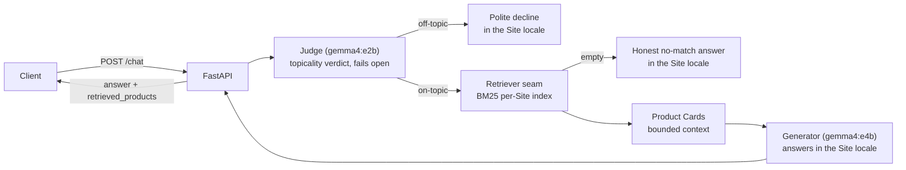

# Assistant (PoC)

A proof-of-concept chatbot API that helps customers of a multi-shop pet-supplies
platform find products, grounded **exclusively** in a per-Site product catalog.
Async FastAPI + a three-stage pipeline — Judge → Retriever → Generator — with
all LLMs served locally by Ollama. No API keys, fully offline.

## High-Level Design



- **Catalog** (`app/catalog`): ingest applies five data-quality policies to
  `product_catalog_dataset.json` and reports what it did (see Decisions), then
  hard-partitions Variants by Site (1 = de-DE/EUR, 3 = en-GB/GBP, 15 = es-ES/EUR).
- **Retrieval** (`app/retrieval`): a `Retriever` protocol — the deliberate seam
  for vector/hybrid/reranker successors. The PoC binds per-Site BM25 with a
  name/brand boost and a minimum-match threshold.
- **Chat** (`app/chat`): Judge → Retriever → Generator. The Judge is a
  prompt-only check on the tiny model; off-topic queries never reach retrieval
  or generation. Declines and no-match answers are static templates in the Site
  locale — zero wasted compute.
- **API** (`app/api`): `POST /chat`, `GET /health`. Handled cases (off-topic,
  no-match) return 200 with `products: [], count: 0`; unknown Site → 404 naming
  the valid Sites; malformed body → 422; Ollama unreachable *during generation*
  → 503 (see the note on the conditional 503 in Decisions).

## Setup and Execution

Requirements: [uv](https://docs.astral.sh/uv/) (provisions Python 3.12 and the
virtualenv automatically) and [Ollama](https://ollama.com) running locally.

```bash
# 1. Models (two: a tiny Judge and a larger Generator — see Decisions)
ollama pull gemma4:e2b
ollama pull gemma4:e4b

# 2. Environment (Python 3.12 + all dependencies)
uv sync

# 3. Run
uv run uvicorn app.main:app
```

Try it:

```bash
curl -s localhost:8000/chat -X POST -H 'Content-Type: application/json' \
  -d '{"site_id": 3, "query": "best dry food for a puppy with a sensitive stomach"}' | python3 -m json.tool

curl -s localhost:8000/chat -X POST -H 'Content-Type: application/json' \
  -d '{"site_id": 1, "query": "Ball zum Apportieren für meinen Hund"}' | python3 -m json.tool

curl -s localhost:8000/chat -X POST -H 'Content-Type: application/json' \
  -d '{"site_id": 3, "query": "What is the weather today?"}' | python3 -m json.tool   # polite decline

curl -s -o /dev/null -w '%{http_code}\n' localhost:8000/chat -X POST \
  -H 'Content-Type: application/json' -d '{"site_id": 7, "query": "dog food"}'        # 404

curl -s localhost:8000/health | python3 -m json.tool
```

Tests (offline — no Ollama needed), lint, live smoke test, and the eval harness
(both need the server + Ollama running):

```bash
uv run pytest
uv run ruff check app tests evals
scripts/smoke.sh
uv run python -m evals.run_eval --base-url http://localhost:8000
```

### PyCharm

The repo ships a `.venv` provisioned by `uv sync` — point PyCharm at it rather
than letting it create a new one:

1. Open the project root, then **Settings → Project → Python Interpreter →
   Add Interpreter → Add Local Interpreter → Existing environment**, and
   select `.venv/bin/python`. (PyCharm 2024.3+ can instead use **Add Local
   Interpreter → uv**, which drives `uv sync` from `pyproject.toml`/`uv.lock`
   directly.)
2. Mark `app/` as **Sources Root** and `tests/` as **Test Sources Root**
   (right-click → Mark Directory as).
3. **Settings → Tools → Python Integrated Tools** → set the default test
   runner to **pytest**.
4. Add a Run/Debug config: module `uvicorn`, parameters
   `app.main:app --reload`, working directory = project root.
5. Copy `.env.example` to `.env` and reference it from the run config's
   environment variables (it's gitignored).

### Observability

Every log line is a JSON object carrying a per-request `request_id` and, for
pipeline stages, `stage` + `duration_ms` (judge / retrieve / generate). For
deeper traces, optional [Arize Phoenix](https://phoenix.arize.com/) integration
ships behind a flag (a true no-op when off):

```bash
docker run -p 6006:6006 arizephoenix/phoenix:latest   # your own container
ZA_TRACING_ENABLED=true uv run uvicorn app.main:app
```

OpenInference spans: `chat` (CHAIN), `judge` (GUARDRAIL), `retrieve`
(RETRIEVER, with ranked documents), `ollama.chat` (LLM, with token counts).

## Decisions and Trade-offs

**Answers follow the Site locale, not the query language.** Site 1 answers in
German, Site 3 in English, Site 15 in Spanish — even for a query written in
another language. This is intended behavior, not a bug: each Site is a branded
shop with one content language, and the answer should match the shop the
customer is standing in. The trade-off (a tourist asking in English on the
German shop gets German) is accepted and documented here deliberately.

**Data quality: the catalog is booby-trapped; ingest defuses it and reports.**

| Finding (this dataset) | Policy |
|---|---|
| 12 exact duplicate rows | dropped |
| 1 Variant listed as both DOGS and CATS (site 15, `2422691.0`) | first record kept, conflict logged |
| 198 unrated Variants with `rating_average: 0.0` | rating nulled — an unrated product must not look like a terrible one |
| 24 Variants at implausible €950–1000 for food/litter multi-packs | quarantined (threshold `ZA_MAX_PLAUSIBLE_PRICE`); a production version would use per-category outlier statistics instead of one flat cap |
| 8 Variants with zero stock | kept retrievable, exposed as `in_stock: false` so the answer can steer to alternatives |
| HTML markup in all text fields | stripped before indexing and prompting |
| Internal Fields (`margin_pct`, `monthly_sales_units`, `revenue_last_30d`, raw `stock_units`) | never parsed into the domain model — excluded from responses by construction |

**Two-model split (ADR 0002).** The Judge runs on `gemma4:e2b`, generation on
`gemma4:e4b`. One model doing both in a single prompt is cheaper, but conflates
two failure modes: guardrail leaks become invisible inside a generation prompt,
and every off-topic query pays full generation latency. The split right-sizes
each stage and makes the guardrail independently testable (the eval harness
scores it standalone). Cost: two `ollama pull` lines, ~17 GB combined.

**BM25 first, behind a seam (ADR 0001).** For ~100 Variants per Site, lexical
BM25 gives strong, explainable retrieval with zero extra infrastructure, and
the assignment's own example queries match catalog text literally. Consciously
accepted gaps: cross-lingual queries (evaluated as `known_limitation` in the
golden set) and paraphrase recall; tokenization has no stemming or stopwords.
The `Retriever` protocol is the seam where multilingual vector search, hybrid
fusion (RRF), and a reranker slot in without touching the pipeline.

**The Judge fails open.** An unparseable verdict or a Judge LLM failure
proceeds to retrieval with a warning log: a false decline hurts a customer
more than an answer that is grounded in catalog data anyway. The generation
prompt is the second line of defense.

**The 503 is conditional, by design.** Because the Judge fails open and both
the decline and no-match answers are static templates (no LLM call), an Ollama
outage surfaces as a 503 *only* when a query actually reaches the Generator —
i.e. it was judged on-topic and retrieval returned at least one Variant. An
off-topic or no-match query still answers 200 from a template with Ollama down.
That is intentional: the service fails loud only when the model was genuinely
needed for that response. `GET /health` reports Ollama reachability separately
for infrastructure probes.

**The tiny Judge can be confidently wrong.** Fail-open handles malformed or
missing verdicts, but the guardrail's harder failure mode is a *well-formed but
wrong* verdict: `gemma4:e2b` occasionally declines a legitimate on-topic query
(reproducibly, for some Spanish phrasings — its own reasoning trace says
"on-topic" while the emitted JSON says `false`). Fail-open cannot catch that,
and it costs a real customer a correct answer. This is the accepted flip side of
right-sizing the guardrail to a tiny model (ADR 0002): some verdict accuracy is
traded for latency and cost. The golden set pins one such phrasing as a
`known_limitation` (`site15-judge-false-decline`) so the gap is tracked rather
than hidden; the fix is a stronger or few-shot-prompted Judge, or a small
labeled calibration set — roadmap, not PoC.

**Hand-rolled pipeline, no framework.** The whole flow is a few hundred lines
readable in one sitting; LangChain/LlamaIndex would hide exactly the decisions
this PoC exists to demonstrate.

**No Docker for the app.** Local LLMs want host GPU access, and the model pull
UX inside containers is poor; `uv sync` already gives a reproducible
environment. Containerization is on the roadmap for production.

**Single-turn only.** `POST /chat` is stateless; multi-turn memory and
streaming are roadmap items.

## Future Roadmap

1. **Hybrid retrieval + reranker through the existing seam**: multilingual
   embeddings, RRF fusion with BM25, then a cross-encoder reranker — gated by
   the eval harness (the cross-lingual `known_limitation` case must flip to PASS).
2. **Evaluation depth**: grow the golden set, add LLM-as-judge scoring for
   groundedness and answer quality, run in CI.
3. **Query planner / agentic tool use**: replace the fixed chain with a planner
   that can filter by price/rating/stock, compare products, and chain retrievals.
4. **Multi-turn conversation and streaming** (SSE) on the same contract.
5. **Guardrail hardening**: replace the tiny Judge with a stronger or
   few-shot-prompted model (or add a small labeled calibration set) to eliminate
   the confidently-wrong declines the eval currently tracks as a
   `known_limitation`, and score guardrail accuracy in CI.
6. **Productionization**: containerize, CI, auth and rate limiting, hosted-LLM
   client behind the existing interface, catalog refresh pipeline instead of
   startup ingest, metrics/dashboards on top of the Phoenix traces.
