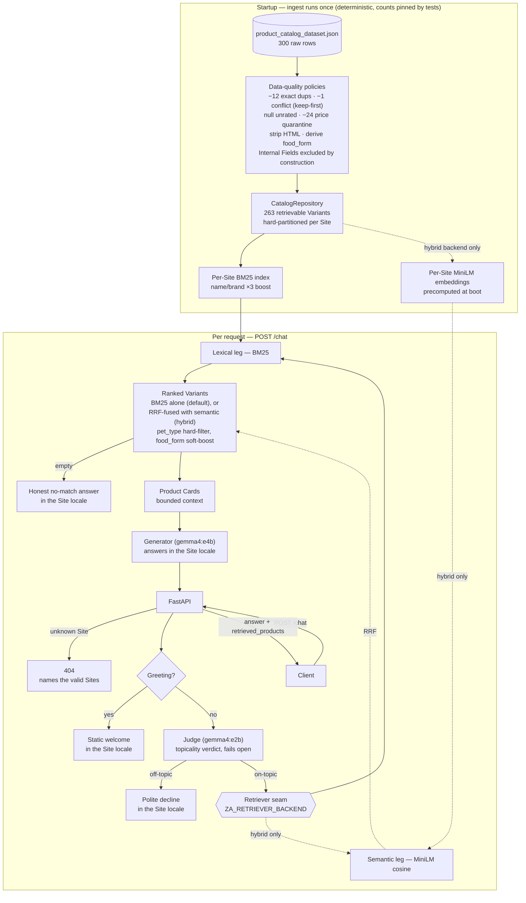

# Assistant (PoC)

A proof-of-concept chatbot API for a multi-shop pet-supplies platform. It
answers product questions using **only** the shop's own catalog. Three stages:
a **Judge** checks the question is on-topic, a **Retriever** finds matching
products, a **Generator** writes the answer. All models run locally with
[Ollama](https://ollama.com) — no API keys, fully offline.

**If you are reviewing this project, a suggested path:**

1. **Quick start** (below) — running in three steps.
2. **The data story** — how each data-quality trap in the catalog is handled.
3. **Design decisions** — every choice with its trade-off stated.
4. **Measured results** — what the eval actually says, including what does
   *not* work.
5. In the code: `grep -rn "TO_EXPLAIN" app` — every consciously deferred
   decision is marked and explained where it lives.

## Quick start

Requirements: [uv](https://docs.astral.sh/uv/) (installs Python 3.12 and all
dependencies for you) and Ollama running locally.

```bash
# 1. Pull the two models (a tiny Judge and a larger Generator — see Decisions)
ollama pull gemma4:e2b
ollama pull gemma4:e4b

# 2. Install
uv sync

# 3. Run
uv run uvicorn app.main:app
```

Then open <http://localhost:8000/> — a small built-in web console with a site
picker, chat, and retrieved-product cards. Or use curl:

```bash
# a normal product question (English site)
curl -s localhost:8000/chat -X POST -H 'Content-Type: application/json' \
  -d '{"site_id": 3, "query": "best dry food for a puppy with a sensitive stomach"}' | python3 -m json.tool

# a German question on the German site
curl -s localhost:8000/chat -X POST -H 'Content-Type: application/json' \
  -d '{"site_id": 1, "query": "Ball zum Apportieren für meinen Hund"}' | python3 -m json.tool

# off-topic -> polite decline, no LLM generation spent
curl -s localhost:8000/chat -X POST -H 'Content-Type: application/json' \
  -d '{"site_id": 3, "query": "What is the weather today?"}' | python3 -m json.tool

# unknown site -> 404 naming the valid sites
curl -s -o /dev/null -w '%{http_code}\n' localhost:8000/chat -X POST \
  -H 'Content-Type: application/json' -d '{"site_id": 7, "query": "dog food"}'

curl -s localhost:8000/health | python3 -m json.tool
```

Verify it yourself (tests are fully offline; the eval needs the server and
Ollama running):

```bash
uv run pytest                                          # full suite, no network needed
uv run ruff check app tests evals                      # lint
scripts/smoke.sh                                       # live end-to-end check
uv run python -m evals.run_eval --base-url http://localhost:8000
```

Optional — semantic retrieval (see [Measured results](#measured-results)
before turning it on):

```bash
uv sync --extra semantic          # ~1 GB of wheels; model downloads on first boot
export ZA_RETRIEVER_BACKEND=hybrid
```

## How it works



The four modules, one line each:

- **`app/catalog`** — cleans the dataset at startup (see
  [The data story](#the-data-story)) and hard-partitions Variants by Site
  (1 = German/EUR, 3 = English/GBP, 15 = Spanish/EUR).
- **`app/retrieval`** — a `Retriever` interface with two bindings: per-Site
  BM25 (default) and an opt-in hybrid that adds sentence embeddings. Both
  apply the same rules: `pet_type` filters hard, `food_form` boosts softly.
- **`app/chat`** — Judge → Retriever → Generator. Greetings, declines and
  no-match answers are static templates in the Site language: zero LLM cost.
- **`app/api`** — `POST /chat`, `GET /health`. Handled cases (off-topic,
  no-match) return 200 with an empty product list; unknown Site → 404;
  malformed body → 422; Ollama down during generation → 503 (see Decisions).

## The data story

The dataset (300 rows; one row = one Variant on one Site; three disjoint
Sites × 100 rows) ships with deliberate data-quality traps. Ingest
(`app/catalog/ingest.py`) runs once at startup and answers each trap with an
explicit, named policy. Nothing is silently "cleaned", and every count below
is pinned by `test_real_dataset_counts_match_the_known_traps` — if a change
shifts any outcome, the suite fails.

| # | What the data contains | Policy | Result |
|---|---|---|---|
| 1 | 12 rows are exact copies of another row | Drop true copies only (keyed by `site_id` + `variant_id`, compared as full records) | −12 rows |
| 2 | One Variant listed as both DOGS and CATS (`2422691.0`, site 15) — same key, different content | Keep the first record, log the conflict. A conflict is not a copy, so it is never dropped silently | −1 row |
| 3 | 198 rows show `rating_average: 0.0` with `rating_count: 0` — "no rating yet" would read as "worst rating" | Null the rating whenever the count is 0 | 174 surviving Variants show *unrated*, not 0.0 |
| 4 | 24 food multi-packs priced €950–1000, while nothing else costs more than €215.64 | Quarantine, don't repair: excluded from retrieval, counted and logged with prices. Cap `ZA_MAX_PLAUSIBLE_PRICE=500` sits in the wide empty gap | −24 Variants |
| 5 | 8 Variants have zero stock | Keep them retrievable — hiding them would hide the product the customer asked about — but expose `in_stock: false` | 8 kept, flagged |
| 6 | HTML in every `description` (300/300) and most `summary`/`ingredients`/`feeding` fields: tables, lists, encoded entities | Strip tags **first**, decode entities **second**. Order matters: the data encodes real text as entities (`&lt;25kg` → `<25kg`); decoding first would let the tag-stripper eat it | Clean, readable text; tables collapse to readable lines |
| 7 | Internal fields (`margin_pct`, `monthly_sales_units`, `revenue_last_30d`, raw `stock_units`) sit next to public fields | Excluded **by construction**: the domain model has no such fields, so no code path — present or future — can leak them | 0 can ever appear in a response |

**One extra finding** (not on the advertised list): 2 rows have an empty
`brands` field (`56322.18`/`56322.19`, site 15). Not repairable from within
the dataset, so they are kept as-is — the brand appears verbatim in
`product_name`, so retrieval is unaffected. A production ingest would
backfill from the name, or null it.

**Record accounting:** 300 raw → −12 duplicates → −1 conflict → 287 unique →
−24 quarantined → **263 retrievable** across Sites 1/3/15.

**Deliberate simplifications** (a fuller pipeline would add these):

- The ingest report carries counts; per-row quarantine detail goes to warning
  logs, not a structured quarantine list.
- HTML is stripped with a regex, not a structure-preserving parser. Verified
  adequate on this dataset: zero cell-concatenation cases.
- A malformed row stops the service loudly at startup. For a startup-ingest
  PoC, a broken feed should stop the service, not degrade it silently.
- Searchable text is assembled inside the BM25 binding; any future retriever
  re-derives its corpus from the same cleaned Variants.

## Design decisions

**Answers follow the shop's language, not the query's.** Site 1 answers in
German, Site 3 in English, Site 15 in Spanish — even if the question comes in
another language. Each Site is one branded shop with one content language.
Trade-off accepted: a tourist asking in English on the German shop gets German.

**Two models, two jobs (ADR 0002).** A tiny Judge screens the question; a
larger Generator writes the answer. One model doing both would hide guardrail
failures inside the generation prompt and make every off-topic query pay full
generation cost. The split also makes the guardrail testable on its own.
Cost: two `ollama pull` lines, ~17 GB combined.

**BM25 by default; semantic retrieval is opt-in (ADR 0001, ADR 0003).** For
~100 Variants per Site, lexical search is strong, explainable, and needs zero
extra infrastructure. The `Retriever` interface is the seam for successors —
and it has been exercised for real: the hybrid backend fuses BM25 with
all-MiniLM-L6-v2 embeddings via Reciprocal Rank Fusion (RRF). It stays
opt-in because of what we measured — see
[Measured results](#measured-results).

**The Judge fails open.** If the Judge crashes or returns an unparseable
verdict, the request continues to retrieval with a warning log. A wrongly
declined customer is worse than an answer grounded in catalog data. The
generation prompt is the second line of defense.

**503 only when the model was genuinely needed.** Greetings, declines and
no-match answers are static templates — they still work with Ollama down.
Only a question that actually reaches the Generator can return 503.
`GET /health` reports Ollama reachability separately for infrastructure
probes.

**Stateless server, multi-turn by contract.** The client may resend the
transcript (`history`, max 10 turns); the server stores nothing. Only the
Generator sees past turns — details and the honest limits under
[Multi-turn](#multi-turn-without-server-state).

**Input fencing on the prompt.** The user query is wrapped in `<query>` tags
and the system prompt asserts that instructions inside the query must not be
followed. This is mitigation, not defense — the output-side verifier is the
roadmap's next step (#5).

**No framework, no Docker.** The pipeline is a few hundred lines readable in
one sitting; LangChain/LlamaIndex would hide exactly the decisions this PoC
exists to demonstrate. Docker is skipped because local LLMs want host GPU
access and `uv sync` already gives a reproducible environment. Both belong to
productionization (roadmap #7).

## Measured results

The golden set (`evals/golden_set.json`) has 13 cases: product queries in
three languages, off-topic queries, and one cross-lingual case marked
`known_limitation`. Both retrieval backends were measured against a live
server (2026-07-11):

| Backend | Headline | Cross-lingual case | Regressions |
|---|---|---|---|
| `bm25` (default) | **12/12** | fails, as documented | none |
| `hybrid` (opt-in) | 11/12 | **passes** | one case drops out of top-5 |

The hybrid regression is instructive, not random. For "wet food for a cat
with kidney problems", BM25 ranks the kidney-care product **#1** (rare exact
word, dominant score) while the semantic leg ranks it **#33** (generic
wet-cat-food similarity wins). RRF rewards agreement between the two lists,
so one list's excellence loses to two lists' mediocrity: fused rank 11, out
of the top-5.

We deliberately did **not** tune the fusion constants until this case passes:
tuning three knobs against 13 cases is overfitting, not fixing. The designed
fix is a reranker over the fused candidates (roadmap #1). Until one
configuration passes the whole set, `bm25` stays the default. Full numbers:
[ADR 0003](docs/adr/0003-hybrid-semantic-retrieval.md).

**A measured guardrail failure and its fix.** The tiny Judge was reproducibly
wrong for some Spanish phrasings: its own reasoning said "on-topic" while the
emitted verdict said `false` — a well-formed wrong answer that fail-open
cannot catch. Fix: a few labeled examples in the Judge prompt. The
originally-failing phrasing stays **unreworded** in the golden set
(`site15-judge-false-decline`) and now passes, with every off-topic case
still declined. A tiny model can still miss an unseen phrasing — that is the
accepted flip side of right-sizing the guardrail (ADR 0002), and scoring it
on a larger labeled set is roadmap #2.

## Known limits (kept deliberately)

- **Cross-lingual queries miss on the default backend** — evaluated as
  `known_limitation`, fixed by the hybrid backend or a multilingual model
  (config swap), pending the reranker (roadmap #1).
- **Hybrid regresses one rare-exact-term case** — why it is opt-in (above).
- **Follow-up questions must keep their topic visible** — the Judge and
  Retriever see only the current query. Query rewriting is roadmap #4.
- **The `history` transcript is client-trusted** — fencing for resent turns
  is on the roadmap (#5).
- **The Judge is a tiny model** — anchored with few-shot examples, still not
  infallible (measured story above).

## Streaming (SSE)

Add `"stream": true` and the same endpoint answers as Server-Sent Events:
a `retrieved` frame with the product cards as soon as retrieval finishes,
`token` frames while the answer generates, then a terminal `done` (full
answer) or `error`. A stream ending without `done` or `error` is a transport
failure. Declines and no-match answers arrive as a single `done`.

```bash
curl -sN localhost:8000/chat -X POST -H 'Content-Type: application/json' \
  -d '{"site_id": 1, "query": "Welches Hundefutter empfiehlst du?", "stream": true}'
```

## Multi-turn (without server state)

The client resends the transcript as `history` (max 10 turns of
`{role, content}`); the built-in web console does this automatically. The
server stays memoryless and only the Generator sees the prior turns. The
Judge and Retriever still see just the current question, so a follow-up must
keep its topic visible: "what about a wet food for the same sensitive
stomach?" works, while a bare "which of those is best?" can be declined.
Both behaviors were verified live; the gap is the roadmap's query-rewrite
step (#4).

```bash
curl -s localhost:8000/chat -X POST -H 'Content-Type: application/json' \
  -d '{"site_id": 3, "query": "what about a wet food for the same sensitive stomach?",
       "history": [
         {"role": "user", "content": "best dry food for a puppy with a sensitive stomach"},
         {"role": "assistant", "content": "I recommend the sensitive-formula puppy dry foods …"}
       ]}' | python3 -m json.tool
```

## Logs and tracing

Every log line is a JSON object with a per-request `request_id` and, for
pipeline stages, `stage` + `duration_ms` (judge / retrieve / generate). For
deeper traces, optional [Arize Phoenix](https://phoenix.arize.com/) support
ships behind a flag (a true no-op when off):

```bash
docker run -p 6006:6006 arizephoenix/phoenix:latest
ZA_TRACING_ENABLED=true uv run uvicorn app.main:app
```

OpenInference spans: `chat` (CHAIN), `judge` (GUARDRAIL), `retrieve`
(RETRIEVER, with ranked documents), `ollama.chat` (LLM, with token counts).

## PyCharm

The repo ships a `.venv` provisioned by `uv sync` — point PyCharm at it:

1. **Settings → Project → Python Interpreter → Add Interpreter → Existing
   environment** → select `.venv/bin/python` (PyCharm 2024.3+ can use
   **Add Local Interpreter → uv** instead).
2. Mark `app/` as **Sources Root** and `tests/` as **Test Sources Root**.
3. **Settings → Tools → Python Integrated Tools** → default test runner:
   **pytest**.
4. Run/Debug config: module `uvicorn`, parameters `app.main:app --reload`,
   working directory = project root.
5. Copy `.env.example` to `.env` (gitignored) and reference it from the run
   config.

## Roadmap

1. **Reranker on top of hybrid retrieval** — *first half shipped* (ADR 0003).
   Remaining: a cross-encoder reranker (the designed fix for the measured
   regression), a multilingual embedding model (config swap), then an ANN
   index / vector DB when catalogs outgrow brute-force cosine.
2. **Evaluation depth** — grow the golden set, add LLM-as-judge scoring for
   groundedness and answer quality, run in CI.
3. **Query understanding** — extract the slots shoppers state (life-stage,
   budget, weight band, health needs, brand): first keyword rules, then LLM
   slot extraction feeding a query planner. Rule stays: authoritative fields
   hard-filter, derived signals soft-boost.
4. **Deeper multi-turn** — *streaming and stateless `history` shipped*.
   Remaining: query rewriting in front of Judge + Retriever so fragment
   follow-ups work; optionally a server-side conversation store.
5. **Guardrail hardening** — *input fencing shipped*. Remaining, in leverage
   order: an output-side verifier (grounded, no invented product/price,
   locale kept), fencing for `history` turns, guardrail-accuracy scoring in
   CI, moderation + pet-health disclaimer, PII redaction on traces.
6. **Latency & cost** — models stay warm (`keep_alive`); next: a persisted
   embedding cache, a semantic response cache, prompt/prefix (KV) reuse, and
   a hosted-LLM backend behind the same client seam.
7. **Productionization** — containerize, CI, auth and rate limiting, catalog
   refresh pipeline instead of startup ingest, metrics on the Phoenix traces.

## What this PoC demonstrates

1. **Data quality is a deliverable, not preprocessing.** Every trap is met by
   a named policy with a pinned count; nothing is silently cleaned.
2. **Policies over repairs.** Quarantine, don't fix (prices); null, don't
   guess (ratings); keep-first and log, don't merge (the conflict).
   An ingest you can explain in one page is an ingest you can defend.
3. **Safety by construction beats filtering.** Internal fields cannot leak
   because the domain model has nowhere to hold them — verified by reading
   one file, not by auditing every code path.
4. **Pin reality in tests.** The dataset's traps are a permanent regression
   guard; any ingest change that shifts an outcome fails the suite loudly.
5. **Clean once, serve every retriever.** BM25 consumes the cleaned corpus
   today; the hybrid backend consumes the same corpus with zero ingest rework
   — that is what made the retrieval seam real.

## Interview anchors — `# TO_EXPLAIN`

Every consciously deferred decision is marked in the code with a
`# TO_EXPLAIN` comment stating the trade-off taken and its evolution path
(`grep -rn "TO_EXPLAIN" app` lists them all):

| Anchor | Decision it explains | Roadmap |
|---|---|---|
| `app/retrieval/embedder.py` | all-MiniLM-L6-v2: small/fast but English-centric; multilingual model is a config swap | #1 |
| `app/retrieval/hybrid.py` (×3) | startup precompute vs persisted store; RRF vs learned weights vs reranker; O(n) cosine vs ANN/vector DB | #1 |
| `app/catalog/facets.py` | query understanding stops at two facets; keyword rules vs LLM slot extraction | #3 |
| `app/api/schemas.py` | stateless client-resent `history` vs a server-side conversation store | #4 |
| `app/chat/service.py` (Judge call) | Judge/Retriever see one standalone query; fragment follow-ups need query rewriting | #4 |
| `app/chat/service.py` (generation) | safety net strong structurally, thin behaviourally; output-side verifier is the highest-leverage move | #5 |
| `app/llm/prompts.py` | `<query>` fencing is mitigation, not defence | #5 |
| `app/core/config.py` | Ollama tuning: keep_alive vs cold loads, num_thread, num_ctx cost/quality, judge token cap | #6 |
