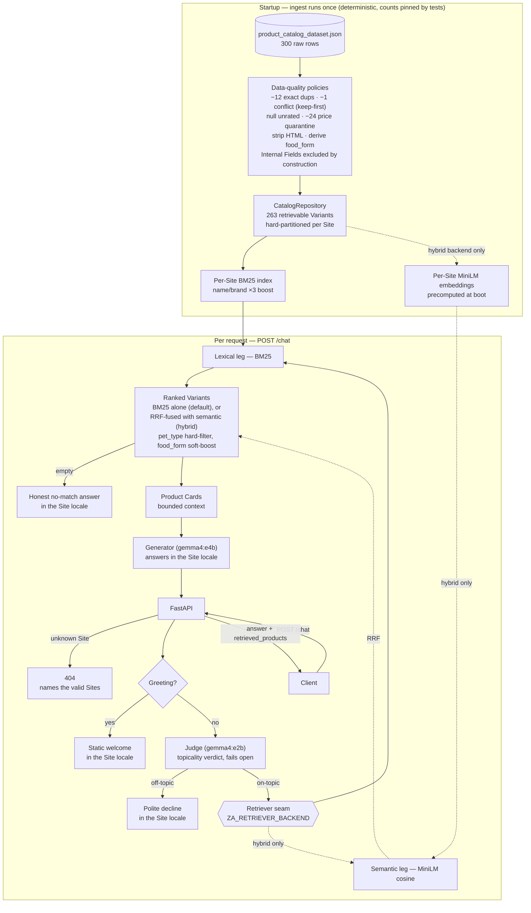

# Assistant (PoC)

A proof-of-concept chatbot API that helps customers of a multi-shop pet-supplies
platform find products, grounded **exclusively** in a per-Site product catalog.
Async FastAPI + a three-stage pipeline — Judge → Retriever → Generator — with
all LLMs served locally by Ollama. No API keys, fully offline.

## High-Level Design



- **Catalog** (`app/catalog`): ingest applies five data-quality policies to
  `product_catalog_dataset.json` and reports what it did (see
  [Data & Ingestion](#data--ingestion)), then
  hard-partitions Variants by Site (1 = de-DE/EUR, 3 = en-GB/GBP, 15 = es-ES/EUR).
- **Retrieval** (`app/retrieval`): a `Retriever` protocol — the deliberate seam
  for vector/hybrid/reranker successors. The default binding is per-Site BM25
  with a name/brand boost and a minimum-match threshold; an opt-in **hybrid
  semantic backend** (ADR 0003) fuses that BM25 leg with all-MiniLM-L6-v2
  embeddings via Reciprocal Rank Fusion behind the same seam
  (`ZA_RETRIEVER_BACKEND=hybrid`), falling back to BM25 with a warning when the
  embedding stack is not installed. Both backends apply the same facet rules:
  `pet_type` hard-filters, `food_form` soft-boosts.
- **Chat** (`app/chat`): Judge → Retriever → Generator, fronted by a
  zero-LLM greeting fast-path (a bare "Hi"/"Hola"/"Hallo" short-circuits to a
  static welcome before the Judge). The Judge is a prompt-only check on the tiny
  model; off-topic queries never reach retrieval or generation. Greetings,
  declines, and no-match answers are static templates in the Site locale — zero
  wasted compute.
- **API** (`app/api`): `POST /chat`, `GET /health`. Handled cases (off-topic,
  no-match) return 200 with `products: [], count: 0`; unknown Site → 404 naming
  the valid Sites; malformed body → 422; Ollama unreachable *during generation*
  → 503 (see the note on the conditional 503 in Decisions).

## Data & Ingestion

The dataset (`product_catalog_dataset.json`) is 300 rows — one row is one
Variant on one Site — split cleanly across three disjoint Sites × 100 rows
(1 = de-DE/EUR, 3 = en-GB/GBP, 15 = es-ES/EUR), 22 fields per row, 150 DOGS /
150 CATS. It ships with deliberate data-quality traps. Ingest
(`app/catalog/ingest.py`) runs once at startup, is deterministic, and defuses
every trap with an explicit policy; every count below is pinned by
`test_real_dataset_counts_match_the_known_traps`, so any ingest change that
shifts an outcome fails the suite.

Walking the pipeline, trap by trap:

1. **Same row twice.** 12 rows are byte-identical copies of another row →
   dropped. Duplicates are keyed by (`site_id`, `variant_id`) and compared as
   full records, so only true copies are dropped silently.
2. **One Variant, two species.** Variant `2422691.0` (site 15) appears twice —
   once as DOGS, once as CATS. Same key, different content: a conflict, not a
   copy. The first record is kept (deterministic, idempotent) and the conflict
   is logged as a warning.
3. **Unrated products look terrible.** 198 raw rows carry
   `rating_average: 0.0` with `rating_count: 0`. Taken literally, "no rating
   yet" reads as "worst possible rating" — so the rating is nulled whenever
   the count is 0. (Counting nuance: 198 counts raw feed rows as a
   source-quality signal; after dedup 192 distinct Variants are affected, 174
   of which survive quarantine.)
4. **The €950 food packs.** 24 Variants cluster at €950–1000 — food and
   cat-litter multi-packs — while nothing else in the catalog costs more than
   €215.64. They are quarantined, not repaired: excluded from retrieval but
   counted and logged with their prices. The threshold
   (`ZA_MAX_PLAUSIBLE_PRICE`, default 500) sits in that wide empty gap; a
   production version would use per-category outlier statistics instead of
   one flat cap.
5. **Zero stock.** 8 Variants have zero stock units. They stay retrievable —
   hiding them would hide the product a customer asks about — but are exposed
   as `in_stock: false` so the answer can steer to alternatives.
6. **HTML everywhere.** Markup or entities appear in every `description`
   (300/300) and in most `summary` (272/300), `ingredients` (217/300) and
   `feeding_recommendations` (209/300) fields — tables (176 rows), lists
   (297 rows), inline markup, encoded entities. Text is normalized by
   stripping tags *first* and decoding entities *second*: the order matters,
   because the catalog encodes real comparisons as entities (`&lt;25kg` →
   `<25kg`) and decoding first would let the tag-stripper eat legitimate
   content. Verified against the real data: nutrition and size tables
   collapse to readable text. Product and variant names are already clean and
   pass through untouched.
7. **Internal Fields sit next to public ones.** Every row carries
   `margin_pct`, `monthly_sales_units`, `revenue_last_30d` and raw
   `stock_units` adjacent to customer-facing fields. They are excluded **by
   construction**: the domain model (`app/catalog/models.py`) has no such
   fields, so no code path — present or future — can leak them into a
   response.

Beyond the advertised traps, profiling also found **2 rows with an empty
`brands` field** (`56322.18`/`56322.19`, site 15, two sizes of one product;
no sibling row carries the brand, so it is not repairable from within the
dataset). They are kept as-is: the brand appears verbatim in `product_name`,
so retrieval is unaffected, and the only visible effect is an empty `brand`
string on those two Product Cards. A production ingest would backfill the
field from the name, or null it.

**Record accounting:** 300 raw → −12 exact duplicates → −1 conflicting
duplicate → 287 unique Variants → −24 quarantined → **263 retrievable**
across Sites 1/3/15.

**What downstream gets:** per-Site, HTML-free, customer-safe Variants,
hard-partitioned by `CatalogRepository`; a per-Site BM25 index built over the
cleaned text with a name/brand boost; an `IngestReport` with all counts,
logged at startup.

**Deliberate simplifications** — a fuller pipeline would add these; the PoC
consciously trades them away:

- The report carries counts only; per-row quarantine and conflict detail goes
  to warning logs rather than a structured quarantine list.
- HTML is stripped with a regex, not a structure-preserving parser
  (`<li>` → bullets, tables → "label: value" lines). Verified adequate on
  this dataset: zero cell-concatenation cases, readable tables.
- A malformed row fails ingest loudly at startup instead of being quarantined
  with a reason: for a startup-ingest PoC, a broken feed should stop the
  service, not degrade it silently.
- The searchable text is assembled inside the BM25 binding; the retrieval
  seam is the `Retriever` protocol itself, so a vector successor re-derives
  its corpus from the same cleaned Variants.

## Setup and Execution

Requirements: [uv](https://docs.astral.sh/uv/) (provisions Python 3.12 and the
virtualenv automatically) and [Ollama](https://ollama.com) running locally.

```bash
# 1. Models (two: a tiny Judge and a larger Generator — see Decisions)
ollama pull gemma4:e2b
ollama pull gemma4:e4b

# 2. Environment (Python 3.12 + all dependencies)
uv sync
# optional — hybrid semantic retrieval (sentence-transformers; ~1 GB of wheels,
# model downloads on first boot):
#   uv sync --extra semantic && export ZA_RETRIEVER_BACKEND=hybrid

# 3. Run
uv run uvicorn app.main:app
# then open http://localhost:8000/ — a small built-in web console
# (site picker, chat, retrieved-product cards); curl works too:
```

Try it from the command line:

```bash
curl -s localhost:8000/chat -X POST -H 'Content-Type: application/json' \
  -d '{"site_id": 3, "query": "best dry food for a puppy with a sensitive stomach"}' | python3 -m json.tool

curl -s localhost:8000/chat -X POST -H 'Content-Type: application/json' \
  -d '{"site_id": 1, "query": "Ball zum Apportieren für meinen Hund"}' | python3 -m json.tool

curl -s localhost:8000/chat -X POST -H 'Content-Type: application/json' \
  -d '{"site_id": 3, "query": "What is the weather today?"}' | python3 -m json.tool   # polite decline

curl -s -o /dev/null -w '%{http_code}\n' localhost:8000/chat -X POST \
  -H 'Content-Type: application/json' -d '{"site_id": 7, "query": "dog food"}'        # 404

curl -s localhost:8000/health | python3 -m json.tool
```

Streaming (opt-in): add `"stream": true` and the same endpoint answers as
Server-Sent Events — a `retrieved` frame with the product cards as soon as
retrieval finishes, `token` frames as the answer generates, then a terminal
`done` (full answer) or `error` (mid-stream failure; the HTTP status is
already 200 by then). A stream that ends without `done` or `error` is a
transport failure. Declines and no-match answers arrive as a single `done`.

```bash
curl -sN localhost:8000/chat -X POST -H 'Content-Type: application/json' \
  -d '{"site_id": 1, "query": "Welches Hundefutter empfiehlst du?", "stream": true}'
```

Multi-turn (stateless): the client may resend the transcript as `history`
(max 10 turns of `{role, content}`); the server stays memoryless and gives the
prior turns to the Generator only — the built-in web console does this
automatically. The Judge and Retriever still see just the current query, so a
follow-up must keep its topic visible: "what about a wet food for the same
sensitive stomach?" works, while a bare referent like "which of those is best?"
can be declined — that gap is the roadmap's query-rewrite step (verified live;
both behaviors are the documented `# TO_EXPLAIN` trade-off):

```bash
curl -s localhost:8000/chat -X POST -H 'Content-Type: application/json' \
  -d '{"site_id": 3, "query": "what about a wet food for the same sensitive stomach?",
       "history": [
         {"role": "user", "content": "best dry food for a puppy with a sensitive stomach"},
         {"role": "assistant", "content": "I recommend the sensitive-formula puppy dry foods …"}
       ]}' | python3 -m json.tool
```

Tests (offline — no Ollama needed), lint, live smoke test, and the eval harness
(both need the server + Ollama running):

```bash
uv run pytest
uv run ruff check app tests evals
scripts/smoke.sh
uv run python -m evals.run_eval --base-url http://localhost:8000
```

### PyCharm

The repo ships a `.venv` provisioned by `uv sync` — point PyCharm at it rather
than letting it create a new one:

1. Open the project root, then **Settings → Project → Python Interpreter →
   Add Interpreter → Add Local Interpreter → Existing environment**, and
   select `.venv/bin/python`. (PyCharm 2024.3+ can instead use **Add Local
   Interpreter → uv**, which drives `uv sync` from `pyproject.toml`/`uv.lock`
   directly.)
2. Mark `app/` as **Sources Root** and `tests/` as **Test Sources Root**
   (right-click → Mark Directory as).
3. **Settings → Tools → Python Integrated Tools** → set the default test
   runner to **pytest**.
4. Add a Run/Debug config: module `uvicorn`, parameters
   `app.main:app --reload`, working directory = project root.
5. Copy `.env.example` to `.env` and reference it from the run config's
   environment variables (it's gitignored).

### Observability

Every log line is a JSON object carrying a per-request `request_id` and, for
pipeline stages, `stage` + `duration_ms` (judge / retrieve / generate). For
deeper traces, optional [Arize Phoenix](https://phoenix.arize.com/) integration
ships behind a flag (a true no-op when off):

```bash
docker run -p 6006:6006 arizephoenix/phoenix:latest   # your own container
ZA_TRACING_ENABLED=true uv run uvicorn app.main:app
```

OpenInference spans: `chat` (CHAIN), `judge` (GUARDRAIL), `retrieve`
(RETRIEVER, with ranked documents), `ollama.chat` (LLM, with token counts).

## Decisions and Trade-offs

**Answers follow the Site locale, not the query language.** Site 1 answers in
German, Site 3 in English, Site 15 in Spanish — even for a query written in
another language. This is intended behavior, not a bug: each Site is a branded
shop with one content language, and the answer should match the shop the
customer is standing in. The trade-off (a tourist asking in English on the
German shop gets German) is accepted and documented here deliberately.

**Data quality: the catalog is booby-trapped; ingest defuses every trap with
an explicit, tested policy.** Twelve duplicate rows, a two-species Variant, a
€950–1000 price cluster, zero-rating-as-unrated, zero stock, HTML in every
description, Internal Fields adjacent to public ones — each finding, the
policy chosen, and the exact counts are walked through in
[Data & Ingestion](#data--ingestion) above.

**Two-model split (ADR 0002).** The Judge runs on `gemma4:e2b`, generation on
`gemma4:e4b`. One model doing both in a single prompt is cheaper, but conflates
two failure modes: guardrail leaks become invisible inside a generation prompt,
and every off-topic query pays full generation latency. The split right-sizes
each stage and makes the guardrail independently testable (the eval harness
scores it standalone). Cost: two `ollama pull` lines, ~17 GB combined.

**BM25 first, behind a seam (ADR 0001).** For ~100 Variants per Site, lexical
BM25 gives strong, explainable retrieval with zero extra infrastructure, and
the assignment's own example queries match catalog text literally. Consciously
accepted gaps: cross-lingual queries (evaluated as `known_limitation` in the
golden set) and paraphrase recall; tokenization has no stemming or stopwords.
The `Retriever` protocol is the seam where multilingual vector search, hybrid
fusion (RRF), and a reranker slot in without touching the pipeline. That seam
has since been exercised for real (ADR 0003): an opt-in hybrid backend fuses
the unchanged BM25 leg with all-MiniLM-L6-v2 embeddings via RRF, precomputing
Variant embeddings per Site at startup. Measured live on the golden set, it is
deliberately **not** the default: hybrid flips the cross-lingual
`known_limitation` case to PASS but drops an exact-rare-term case
(`site3-cat-kidney`: BM25 rank 1 vs semantic rank 33 → fused rank 11 — RRF
rewards two-list agreement over one-list excellence). 12/12 beats 11/12+flip,
so BM25 stays the default until a reranker or learned fusion weights recover
both cases under the eval harness (roadmap #1; the full numbers are in
ADR 0003).

**The Judge fails open.** An unparseable verdict or a Judge LLM failure
proceeds to retrieval with a warning log: a false decline hurts a customer
more than an answer that is grounded in catalog data anyway. The generation
prompt is the second line of defense.

**The 503 is conditional, by design.** Because the Judge fails open and both
the decline and no-match answers are static templates (no LLM call), an Ollama
outage surfaces as a 503 *only* when a query actually reaches the Generator —
i.e. it was judged on-topic and retrieval returned at least one Variant. An
off-topic or no-match query still answers 200 from a template with Ollama down.
That is intentional: the service fails loud only when the model was genuinely
needed for that response. `GET /health` reports Ollama reachability separately
for infrastructure probes.

**The tiny Judge can be confidently wrong — anchored with few-shot examples.**
Fail-open handles malformed or missing verdicts, but the guardrail's harder
failure mode is a *well-formed but wrong* verdict: `gemma4:e2b` would declare a
legitimate on-topic query off-topic (reproducibly, for some Spanish phrasings —
its own reasoning trace says "on-topic" while the emitted JSON says `false`),
which fail-open cannot catch and which costs a real customer a correct answer.
`JUDGE_SYSTEM` now carries a few labeled examples (an indirect Spanish product
request → on-topic; weather and pet-trivia → off-topic) that anchor the tiny
model: the phrasing it used to mis-decline (`site15-judge-false-decline`, kept
**unreworded** in the golden set) now passes the live eval, with every off-topic
case still declined. This does not make a tiny model infallible — an unseen
phrasing could still slip through, the accepted flip side of right-sizing the
guardrail to a tiny model (ADR 0002) — so scoring guardrail accuracy on a larger
labeled set stays on the roadmap. But the tracked gap is closed by a real fix,
not hidden.

**Hand-rolled pipeline, no framework.** The whole flow is a few hundred lines
readable in one sitting; LangChain/LlamaIndex would hide exactly the decisions
this PoC exists to demonstrate.

**No Docker for the app.** Local LLMs want host GPU access, and the model pull
UX inside containers is poor; `uv sync` already gives a reproducible
environment. Containerization is on the roadmap for production.

**Stateless server, multi-turn by contract.** `POST /chat` streams on request
(`"stream": true`, SSE) and accepts an optional `history` of prior turns —
the stateless option (a) of the conversation design doc: the client owns and
resends the transcript, the server keeps no store, and only the Generator sees
the prior turns. The accepted trade-offs, documented at the `# TO_EXPLAIN`
anchors: the transcript is client-trusted, and the Judge/Retriever still see
one standalone query, so fragment follow-ups need the roadmap's
query-rewrite/coreference step (a server-side conversation store is the
alternative when smaller requests or a server-owned transcript matter).

## Conclusions

What the data work of this PoC demonstrates:

1. **Data quality is a deliverable, not preprocessing.** The catalog's traps
   are the assignment's data-awareness test; each one is met by an explicit,
   named policy with a pinned count. Nothing is silently "cleaned".
2. **Policies over repairs.** Quarantine, don't fix (24 prices); null, don't
   guess (198 ratings); keep-first and log, don't merge (1 conflict).
   Deterministic and auditable beats clever: an ingest you can explain in one
   page is an ingest you can defend.
3. **Safety by construction beats filtering.** Internal Fields cannot leak
   because the domain model has no fields to hold them. A structural
   guarantee is verified by reading one model; a filter would have to be
   verified on every code path, every time a new one is added.
4. **Pin reality in tests.** `test_real_dataset_counts_match_the_known_traps`
   turns the dataset's traps into a permanent regression guard: any ingest
   change that shifts an outcome — a count, a leaked tag, a cross-Site row —
   fails the suite loudly.
5. **Clean once, serve every retriever.** The per-Site, HTML-free corpus is
   what makes the retrieval seam real: BM25 consumes it today; the planned
   vector/hybrid successor consumes the same corpus tomorrow with zero ingest
   rework. What production would change is known and bounded: per-category
   outlier statistics instead of a flat price cap, a refresh pipeline instead
   of startup ingest, a structured quarantine report for operations, and
   backfill-or-null for the two empty-brand rows.

## Future Roadmap

1. **Hybrid retrieval + reranker through the existing seam** — *first half
   shipped* (ADR 0003): BM25 + all-MiniLM-L6-v2 fused with RRF, opt-in via
   `ZA_RETRIEVER_BACKEND=hybrid`. Live-measured: it flips the cross-lingual
   `known_limitation` case to PASS but regresses one exact-rare-term case
   (details in ADR 0003), so it stays opt-in. Remaining: a cross-encoder
   reranker on the fused top-k (the designed fix for that regression),
   a multilingual embedding model (config-only swap), then an ANN index or
   vector DB (FAISS/pgvector/Qdrant) with a persisted embedding store when
   catalogs outgrow brute-force cosine and startup precompute.
2. **Evaluation depth**: grow the golden set, add LLM-as-judge scoring for
   groundedness and answer quality, run in CI.
3. **Query understanding: slot extraction, then a planner**. Today intent
   stops at two rule-based facets (`pet_type` hard-filters, `food_form`
   soft-boosts). Next: extract the slots shoppers actually state — life-stage,
   budget/price ceiling, weight band, dietary/health needs, brand — first as
   high-precision keyword rules, then as an LLM slot-extraction step feeding a
   query planner that can filter by price/rating/stock, compare products, and
   chain retrievals. Rule of thumb stays: only authoritative clean fields
   hard-filter; derived signals soft-boost.
4. **Deeper multi-turn** — *streaming (SSE) and stateless `history` shipped*.
   Remaining: the query-rewrite/coreference step in front of Judge + Retriever
   so fragment follow-ups ("what about the wet one?") become self-contained
   queries, and optionally a server-side conversation store (`conversation_id`,
   TTL/eviction) when the client-resent transcript stops being acceptable.
5. **Guardrail hardening** — *input side started*: the query is fenced in
   `<query>` tags and the system prompt asserts an instruction hierarchy.
   Remaining, in leverage order: an **output-side verifier** (grounded in the
   retrieved cards, no invented product/price, Site locale kept, no system-
   prompt leak — applied before the streaming `done` too), fencing for resent
   `history` turns, a larger labeled calibration set with guardrail-accuracy
   scoring in CI, moderation and a pet-health disclaimer, and PII redaction on
   traced span attributes.
6. **Latency & cost**: `keep_alive` now holds models warm and the Judge stops
   at a 16-token verdict; next is caching — embedding cache persisted across
   restarts, a semantic response cache for repeated intents, and prompt/prefix
   (KV) cache reuse for the static system + product-context blocks — plus
   speculative decoding or a hosted-LLM backend behind the same client seam.
7. **Productionization**: containerize, CI, auth and rate limiting, hosted-LLM
   client behind the existing interface, catalog refresh pipeline instead of
   startup ingest, metrics/dashboards on top of the Phoenix traces.

## Interview anchors — `# TO_EXPLAIN`

Every consciously-deferred decision is marked in the code with a
`# TO_EXPLAIN` comment explaining the trade-off taken and its evolution path
(`grep -rn "TO_EXPLAIN" app` lists them all). Map to the roadmap:

| Anchor | Decision it explains | Roadmap |
|---|---|---|
| `app/retrieval/embedder.py` | all-MiniLM-L6-v2: small/fast but English-centric; multilingual model is a config swap | #1 |
| `app/retrieval/hybrid.py` (×3) | startup precompute vs persisted store; RRF vs learned weights vs reranker; O(n) cosine vs ANN/vector DB | #1 |
| `app/catalog/facets.py` | query understanding stops at two facets; keyword rules vs LLM slot extraction | #3 |
| `app/api/schemas.py` | stateless client-resent `history` vs a server-side conversation store | #4 |
| `app/chat/service.py` (Judge call) | Judge/Retriever see one standalone query; fragment follow-ups need query rewriting | #4 |
| `app/chat/service.py` (generation) | safetynet strong structurally, thin behaviourally; output-side verifier is the highest-leverage move | #5 |
| `app/llm/prompts.py` | `<query>` fencing is mitigation, not defence | #5 |
| `app/core/config.py` | Ollama tuning: keep_alive vs cold loads, num_thread, num_ctx cost/quality, judge token cap | #6 |
